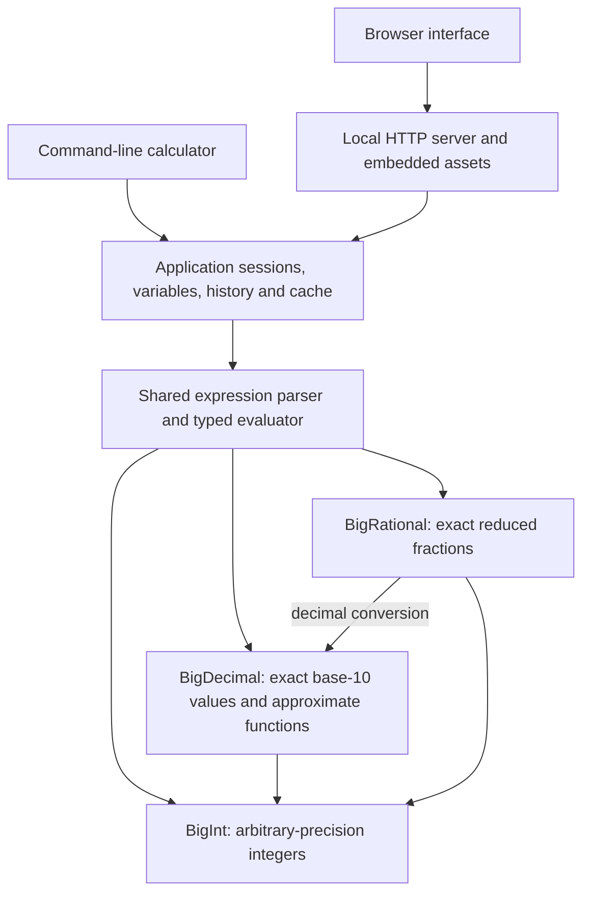

# NumForge


**Exact arithmetic. High-precision math. One C17 core.**

[](https://github.com/Interacti0n/NumForge/actions/workflows/ci.yml)
[](https://github.com/Interacti0n/NumForge/releases/latest)
[](LICENSE)
[](docs/guides/LIBRARY_GUIDE.md)
[](CMakeLists.txt)

NumForge is a C17 mathematics library for arbitrary-precision integers
(`BigInt`), exact decimals (`BigDecimal`), and reduced fractions
(`BigRational`). It also includes optional command-line and local browser
calculators. Both calculators use the same C expression parser and numeric
library.

**In the working tree (unreleased):** [decimal and exact rational complex APIs](docs/reference/BIGCOMPLEX.md),
calculator `a+bi` / `complex(re;im)` arithmetic, re/im/conj/abs/arg and complex
exponentials, principal square roots, natural/custom-base logarithms, general powers,
trigonometry and hyperbolic functions,
typed sessions and Cartesian/trigonometric/
exponential display. Existing 2.1.0 release archives do not contain these features.

**Released in 2.1.0:** unit conversion, dimensional arithmetic with `qty(...)`,
session variables and ready-to-use application and C/C++ SDK downloads.

[Try it locally](#get-started) · [See the calculator](#in-the-browser) ·
[Use the C/C++ SDK](#cc-sdk) ·
[Explore the architecture](#architecture) · [Browse the API](docs/API.md) ·
[Latest release](https://github.com/Interacti0n/NumForge/releases/latest)

## NumForge in 15 seconds

Try these in either calculator. Select **Full** precision to keep every digit
of exact results, with **Plain** notation for decimals/integers or **Fraction**
notation for fractions:

| Expression | Result |
| --- | --- |
| `0.1 + 0.2` | `0.3` — exact decimal arithmetic |
| `2^128` | `340282366920938463463374607431768211456` |
| `1/3 + 1/6` | `1/2` — an exact, reduced fraction |
| `sqrt(4/9)` | `2/3` — an exact rational root |
| `convert(90; "km/h"; "m/s")` | `25` — compatible unit conversion |
| `qty(5; "m") * qty(5; "m")` | `25 m²` — dimensional arithmetic |

Conversions with exact factors preserve fractions too:
`convert(1/3; "km"; "m")` returns `1000/3`. The bilingual
[unit converter](docs/guides/UNIT_CONVERTER.md) offers a sourced catalogue of
233 units and checks compatibility before converting.

For an irrational result, choose **Plain** notation and **40** output places:

```text
sqrt(2) ≈ 1.4142135623730950488016887242096980785697
```

You can also calculate `100!` as an exact 158-digit integer, or request more
than 500 digits of π, e and φ, computed dynamically. The local browser calculator
runs entirely on your machine using the same C library as the command line.

## In the browser

Exact fractions, a separate decimal hint, confirmed history and a searchable
function library in the current English interface:


<details>
<summary>See the responsive mobile calculator</summary>

<p></p>

</details>

Screenshots show the current development interface; release archives may have an
earlier layout. The calculator is available in English and Slovak.

## What it does

- Integer, decimal, and rational arithmetic, including configurable decimal
  rounding and conversion between numeric types.
- Powers, roots, logarithms, trigonometric and hyperbolic functions, constants,
  and statistics in the calculators.
- Exact rational results where possible; precision-aware approximations for
  results that cannot be represented exactly.
- A Slovak/English browser calculator served by a self-contained local
  executable. Running it requires no Node.js, database, or external service.
- [Unit conversion](docs/guides/UNIT_CONVERTER.md) in the SK/EN browser, C and [local HTTP APIs](docs/reference/UNIT_HTTP_API.md),
  with a sourced 233-unit catalogue and compatibility checks.
- Unit, property, integration, browser, fuzz, and package-consumer checks.

The numeric library is available through the public headers in
[`include/numforge/`](include/numforge). Calculator syntax, the local HTTP
endpoint, and application limits are documented in the [API overview](docs/API.md).

## Get started

Requires CMake 3.20 or later and a C17 compiler.

Start from a [release source archive](https://github.com/Interacti0n/NumForge/releases/latest)
or clone the current development version:

```sh
git clone https://github.com/Interacti0n/NumForge.git
cd NumForge
```

Build the library and both calculators without test dependencies:

```sh
cmake -S . -B build -DCMAKE_BUILD_TYPE=Release -DBUILD_TESTING=OFF
cmake --build build --config Release
```

Run `numforge_web` from the build directory (or `build/Release/` with Visual
Studio) to open the local calculator at `http://127.0.0.1:8765`. It listens
only on the local machine. Use `--port N` to choose a port or `--no-browser`
to suppress automatic browser opening. Run `calculator` for the interactive
command-line calculator.

For access from phones or remote browsers, use an HTTPS tunnel or reverse proxy
and an explicit `--origin`; see the [hosting guide](docs/guides/HOSTING.md).

For example, with a single-configuration build on Linux/macOS:

```sh
./build/numforge_web --port 8765
./build/calculator
```

On Windows with Visual Studio, run either application from PowerShell:

```powershell
.\build\Release\numforge_web.exe --port 8765
.\build\Release\calculator.exe
```

In the CLI, use `precision full` and `notation plain` for the exact decimal and
integer examples above, or `notation fraction` for exact fractions. Use
`precision 40` for the illustrated square root, and `quit` to exit.

To run without a compiler, download the portable Windows x64 ZIP or Linux x64
tar.gz from the [2.1.0 release](https://github.com/Interacti0n/NumForge/releases/tag/v2.1.0).
Verify its SHA-256, extract the entire archive and launch `numforge_web.exe`
(Windows) or `./numforge_web` (Linux); the browser opens automatically on Windows.
Both archives also include the CLI. Windows binaries are unsigned; Linux requires
glibc. No Node.js, Python or database is needed. See
[release packaging](docs/project/RELEASE_PACKAGING.md) for compatibility and
verification. A hosted demo remains future distribution work.

## C/C++ SDK

Use NumForge in your own application **without compiling the NumForge source
tree**. Download a prebuilt SDK and its matching SHA-256 file from the
[2.1.0 release](https://github.com/Interacti0n/NumForge/releases/tag/v2.1.0):

| Platform | SDK archive | Toolchain |
| --- | --- | --- |
| Windows x64 | `NumForge-2.1.0-sdk-win-x64.zip` | MSVC, Release `/MD` |
| Linux x64 | `NumForge-2.1.0-sdk-linux-x64.tar.gz` | GCC, glibc |

Each SDK contains the public headers, a static library, relocatable CMake
exports and a working example. It exposes BigInt, BigDecimal, BigRational,
units and runtime APIs. C++ can use the same headers with automatic C linkage.
The calculator parser, sessions and HTTP server belong to the application
download, outside this numeric SDK.

For example, exact decimal addition in C:

```c
#include <stdio.h>
#include <stdlib.h>
#include <numforge/bigdecimal.h>

int main(void)
{
    BigDecimal *a = bigdecimal_create(), *b = bigdecimal_create();
    char *text = NULL;
    int result = 1;
    if (a == NULL || b == NULL) goto cleanup;
    if (bigdecimal_set_string(a, "0.1") != BIGDECIMAL_OK ||
        bigdecimal_set_string(b, "0.2") != BIGDECIMAL_OK ||
        bigdecimal_add(a, a, b) != BIGDECIMAL_OK ||
        bigdecimal_to_string(a, &text) != BIGDECIMAL_OK) goto cleanup;
    printf("0.1 + 0.2 = %s\n", text); /* 0.1 + 0.2 = 0.3 */
    result = 0;
cleanup:
    free(text);
    bigdecimal_destroy(a);
    bigdecimal_destroy(b);
    return result;
}
```

Link your C or C++ target through CMake:

```cmake
find_package(NumForge 2.1 CONFIG REQUIRED)
target_link_libraries(my_target PRIVATE NumForge::numforge)
```

Configure with `-DCMAKE_PREFIX_PATH=/absolute/path/to/extracted-sdk`. To try the
included example, run these commands from the extracted SDK directory:

```sh
cmake -S example -B example-build -DCMAKE_BUILD_TYPE=Release
cmake --build example-build --config Release
```

You need CMake and a compatible C/C++ compiler for your application. Check
`BUILDINFO.json` for the compiler/runtime baseline; Windows requires a compatible
x64 MSVC toolchain and `/MD`. The [SDK quick start](docs/guides/SDK.md) covers
verification and platform setup. For other toolchains or a library-only source
build, see the [library guide](docs/guides/LIBRARY_GUIDE.md).

Existing 1.x numeric C signatures remain source compatible in 2.1. CMake
consumers that explicitly requested package major version 1 must update their
`find_package` requirement. The calculator and local HTTP server are optional
clients, outside the public numeric C API.

## Architecture

The CLI and browser share the C expression parser, evaluator and session logic.
The browser sends expressions to a loopback HTTP server; JavaScript handles the
interface while the numerical work stays in C.



Applications can also link the numeric library directly, without either
calculator. Public types are opaque; mutating operations preserve the destination
on failure and support the documented aliasing cases. Read the
[architecture overview](docs/design/ARCHITECTURE.md) for boundaries and ownership.

## Measured performance

Selected opt-in Release benchmark results on **Windows x64, Ryzen 7 7435HS,
MSVC 19.51**. Ranges span the medians of three recorded runs; parsing and
formatting are excluded from direct arithmetic timings.

| Operation | Input | Median range |
| --- | --- | ---: |
| BigInt multiplication | Two 4096-bit integers | 26.8–28.3 µs |
| BigInt multiplication | Two 65536-bit integers | 6.67–7.14 ms |
| Public factorial | `10000!` | 31.82–32.50 ms |
| Auto scientific formatting | 16384 decimal digits, 10 output places | 2.951–2.975 ms |
| BigDecimal addition, equal scales | Two 2000-digit coefficients | 1.357–1.456 µs |
| Square root | `sqrt(2)`, 1000 significant digits | 11.928–12.698 ms |

These instrumented measurements describe one machine, not universal speed
guarantees. The arithmetic suite checks 1084 scenarios against independent exact
references. Private optimization experiments are reported separately and are
not production features. See [BigInt measurements](docs/benchmarks/BIGINT_BENCHMARKS.md) and
[formatting/cache/memory methodology](docs/benchmarks/BENCHMARKS.md) to reproduce the runs,
inspect allocation costs and understand their limits.
The [decimal/math measurements](docs/benchmarks/DECIMAL_MATH_BENCHMARKS.md) document the
new suite, including high-precision timeouts and the extreme tangent-pole
accuracy limitation; those cases are excluded from successful timing claims.

## Current scope and roadmap

Development updates: tangent pole regressions now pass strict references
through 2,000 digits. Short scientific formatting uses outward-rounded bounds
with exact fallback. Benchmark reports preserve the historical failures and
record the subsequent fixes separately.

**Available:** the numeric C library, CLI and local bilingual browser calculator,
exact rational arithmetic, configurable precision/rounding, scientific functions,
session variables/history, BigInt bases 2–36, unit-conversion C/HTTP APIs,
and opt-in benchmarks.

**Next:** Accuracy follow-ups and optimizations supported by the collected data.
Direct [BigDecimal and higher-function measurements](docs/benchmarks/DECIMAL_MATH_BENCHMARKS.md)
include strict references and explicit stress-case limitations.
Session variables and BigInt conversion in bases 2–36 are implemented.
User functions and language bindings are future work. Graphs, equations and
account links currently lead to informational pages. See the
[roadmap](docs/project/ROADMAP.md) for scope and prerequisites; no delivery dates are promised.

## Test

```sh
cmake -P cmake/LocalBuild.cmake
```

This configures a local Release build, builds it, and runs CTest. The first
test-enabled configuration needs Git and internet access to fetch Unity.
Node.js enables the optional CLI, numeric-oracle, and web-script tests; the
browser suite additionally uses Playwright. See the [testing guide](docs/TESTING.md)
for individual checks, CI coverage, and benchmarks.

## Contributing

Bug reports, small fixes, documentation and independently checked numerical
cases are welcome. Start with [CONTRIBUTING.md](CONTRIBUTING.md) for local setup,
validation and pull-request guidance. For a numerical issue, include the exact
expression or API call, precision, rounding mode, expected value and reference.

## Documentation

Read the [short changelog](CHANGELOG_SHORT.md) for release highlights.
Browse the [documentation guide](docs/README.md) by task or the
[benchmark tools](benchmarks/README.md) by purpose.

| Document | Contents |
| --- | --- |
| [Variables](docs/guides/VARIABLES.md) | Session assignments, exact snapshots and lifetime. |
| [Session HTTP API](docs/reference/SESSION_HTTP_API.md) | Typed values, saved histories, lifecycle and function discovery. |
| [Library guide](docs/guides/LIBRARY_GUIDE.md) | Build, install, and consume the C library. |
| [SDK quick start](docs/guides/SDK.md) | Download a prebuilt C/C++ library, choose a toolchain and link your application. |
| [API overview](docs/API.md) | Public types, ownership, calculator syntax, and local HTTP API. |
| [Architecture overview](docs/design/ARCHITECTURE.md) | Numeric layers, clients, ownership and project boundaries. |
| [BigInt design](docs/design/BIGINT_DESIGN.md) | Representation, semantics, and implementation. |
| [BigDecimal design](docs/design/BIGDECIMAL_DESIGN.md) | Decimal representation, rounding, and future work. |
| [Calculator design](docs/design/CALCULATOR_DESIGN.md) | Parser, evaluation, CLI/web behavior, and limits. |
| [Web source](web/README.md) | Editable HTML, CSS, JavaScript, and embedded asset build. |
| [Testing guide](docs/TESTING.md) | Test suites, CI, fuzzing, and performance checks. |
| [BigInt measurements](docs/benchmarks/BIGINT_BENCHMARKS.md) | Arithmetic baseline, exact references and private experiments. |
| [Formatting/cache measurements](docs/benchmarks/BENCHMARKS.md) | Timing phases, memory measurements and reproduction. |
| [Roadmap](docs/project/ROADMAP.md) | Available capabilities, planned work and prerequisites. |
| [Project presentation](docs/project/PROJECT_PRESENTATION.md) | README assets, screenshot capture and presentation maintenance. |
| [Release packaging](docs/project/RELEASE_PACKAGING.md) | Portable Windows/Linux archives, verification and publishing. |
| [Decimal/math measurements](docs/benchmarks/DECIMAL_MATH_BENCHMARKS.md) | Direct BigDecimal and high-precision math benchmarks, independent references and limitations. |

## Repository layout

```text
include/numforge/     Public C library headers
src/
  bigint/            Integer arithmetic
  bigdecimal/        Decimal arithmetic and scientific functions
  bigrational/       Exact rational arithmetic
  units/             Unit catalogue and compatible numeric conversion
  calculator/        Expression parsing, evaluation and numeric formatting
  application/       Sessions, variables, history and client/cache ownership
  web/               Local HTTP server and API
  internal/          Private allocation and diagnostic support
  main.c             CLI entry point
web/                 Editable browser assets
tests/               Regression suites, browser checks and package consumers
benchmarks/          Opt-in measurement tools
  references/        Frozen math references and their generator
docs/                Categorized guides, reference, design, tests and reports
  images/            README screenshots
cmake/               Build, embedding and package helpers
scripts/             Release packaging tools
.github/workflows/   CI and release automation
```

Generated builds, installed staging files and raw benchmark recordings are
ignored local outputs; they are not part of the source tree.

## License

NumForge is available under the [MIT License](LICENSE). Copyright (c) 2026
Interacti0n.
