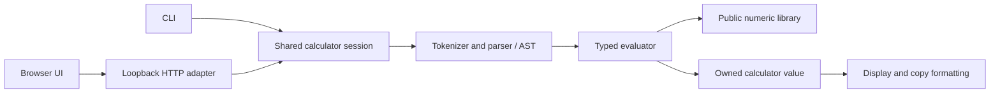

# Architecture overview

NumForge has a standalone numeric library and two optional clients. The installed
`NumForge::numforge` CMake target contains the numeric types and optional runtime
budget API. Parser, sessions and HTTP transport belong to the clients, not the
installed numeric API.

## Numeric layers

| Layer | Representation and responsibility |
| --- | --- |
| BigInt | Signed integers with little-endian 64-bit magnitude limbs; exact integer operations, division, roots and number theory. |
| BigDecimal | An integer coefficient and signed decimal scale; exact decimal operations plus precision/rounding-aware division and higher functions. |
| BigRational | Reduced numerator/denominator BigInts; exact fractions, arithmetic and conversion to/from decimals. |
| Runtime budgets | Optional caller-owned, thread-local allocation/deadline scopes; ordinary library calls start no implicit budget. |

All public numeric types are opaque. Callers own created objects and returned
text according to each API's contract. Mutating public operations preserve the
destination on failure and support documented output/input aliasing. Exact
operations stay exact; approximate functions take precision and rounding
explicitly. Guard digits do not by themselves prove correct rounding in every
case; the [roadmap](ROADMAP.md) records that remaining work.

## Client dependency flow

Arrows show the simplified call/data path. The session owns confirmed `ans`,
history and preview state; parsing and evaluation are shared by CLI/web. Exact
branches use BigRational and retain their internal value through confirmation,
history and cache. Decimal/approximate branches use BigDecimal. Formatting
projects the stored value for display without replacing it with rounded text.

The browser handles input, navigation and presentation in JavaScript. Expressions
are sent to the local C server for numerical evaluation. The server embeds the
HTML/CSS/JavaScript/image assets at build time; its installed executable does
not need Node.js, an asset directory or a database to run. It listens on loopback
and has bounded requests, cooperative resource budgets and in-memory sessions.
It is not a production public-hosting architecture.

## Source map

| Location | Role |
| --- | --- |
| `include/numforge/` | Installed public API contracts. |
| `src/bigint/`, `src/bigdecimal/`, `src/bigrational/` | Numeric implementations. |
| `src/units/` | Static unit registry and exact compatible-unit conversion over public BigRational API. |
| `src/web/unit_web.c` | Local HTTP unit catalogue and conversion adapter; borrows session values, preserves typed exact input and shares calculator budgets. |
| `src/internal/` | Private allocation boundaries and optional benchmark instrumentation. |
| `src/calculator/` | Tokenizer, AST, typed evaluator, values, formatting and sessions. |
| `src/main.c` | Interactive CLI. |
| `src/web/` | Local server, HTTP framing and evaluation adapter. |
| `web/` | Editable English/Slovak browser assets. |
| `web/units.*` | Responsive unit-converter pages, calculator component styles and cancellable read-only conversion requests. |
| `cmake/EmbedWeb.cmake` | Generates the embedded assets in the build tree. |
| `tests/`, `benchmarks/` | Correctness checks and opt-in performance measurements. |

Benchmark diagnostics are opt-in and are not part of the public API or ordinary
release package. Phase timing and live-allocation tracking are separate probes.
Private product-tree/square experiments do not change production arithmetic.

Read [the API overview](API.md), [BigInt design](BIGINT_DESIGN.md),
[BigDecimal design](BIGDECIMAL_DESIGN.md) and
[calculator design](CALCULATOR_DESIGN.md) for the detailed contracts and modules.
